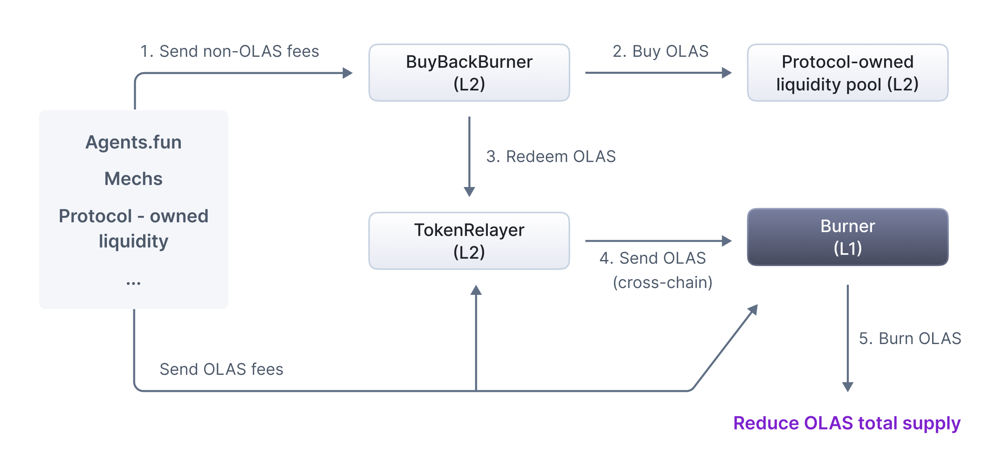

[AIP-5](https://github.com/valory-xyz/autonolas-aip/blob/aip-5/content/aips/automate_relayer_marketplace.md) discussed how fees can be earned from the mech marketplace. This proposal discusses how these fees may be used. We propose the introduction of a module available across all chains where the Olas Protocol is deployed. This module will accept both the chain's native token and OLAS and includes a mechanism for using native tokens to buy OLAS. The module furthermore supports the transfer of all accumulated OLAS to the Ethereum mainnet for burning.

## Introduction

This proposal introduces a universal buy-back-and-burn module designed to reduce the total supply of OLAS tokens. The module is deployable across all chains where Olas operates, and it allows for the seamless collection of fees in both native tokens and OLAS. Native tokens collected are utilized to purchase OLAS via decentralized exchanges (DEXs), ensuring price stability through time-weighted average price (TWAP) checks. Accumulated OLAS is subsequently transferred to Ethereum mainnet for burning, ensuring a consistent and transparent reduction in token supply. The mechanism is flexible and universal, accommodating current and future fee-generating use cases on Olas, such as dApp fees, protocol-owned liquidity, mech marketplace transactions, and developer rewards. By aligning economic incentives and fostering long-term sustainability, the module serves as a scalable solution for strengthening the Olas ecosystem.

## Take-away points

1. AIP-6 proposes a mechanism in order to use the fees generated within Olas ecosystem (including the ones introduced in AIP-5) in order to strengthen OLAS;
2. This is done via a buy-back-and-burn mechanism which receives all the fees in order to buy back OLAS and then burn it, reducing the total supply;
3. The module is implemented, audited, and live across all major Olas chains (Ethereum, Polygon, Gnosis, Arbitrum, Optimism, Base, and Celo), generalizing the mechanism to all fees within the Olas ecosystem.

## Motivation

The buy-back-and-burn module provides a mechanism to reduce the total supply of OLAS by burning tokens accumulated from various use cases. Its universal design allows any new dApp or mechanism deployed on Olas to use it.

The Olas ecosystem has multiple existing and potential fee-generating use cases:

1. Fees from dApps built on the Olas Protocol, e.g. revenue from agents.fun, a launchpad for autonomous AI agent-affiliated meme coins, generated through liquidity providers (LPs); 
2. Fees from payments through the mech marketplace, where autonomous AI agents hire other agents (mechs) for specific tasks;
3. Fees from protocol-owned liquidity;
4. Fees from dev rewards in ETH, when the DAO decides to turn on the fee switch;
5. fees from protocol-owned services (as per [AIP-2](https://github.com/valory-xyz/autonolas-aip/blob/aip-2/content/aips/core-build-a-pose.md));

One can envision the possibility of further fee drivers:

1. Large-scale use cases like Olas Predict and Olas native mechanisms (e.g. dev rewards) could lead to the creation of Olas’ own L2 chain, generating sequencer fees;
2. Staking mechanisms could include a registration fee in OLAS, disincentivising Operators to not remain active or leaving slots unused.

This is not an exhaustive list but it should become clear at this point that a generic mechanism for facilitation of buy-back-and-burn is needed.

## Technical details

### Specification

The buy-back-and-burn module consists of three on-chain components: the **BuyBackBurner** (with its supporting **price oracles**), the **Bridge2Burner**, and the L1 OLAS **Burner**.

#### BuyBackBurner

The **BuyBackBurner** is a proxy-upgradeable contract — deployed behind a **BuyBackBurnerProxy** and initialized via `initialize` — instantiated once per chain. It is provided as an abstract base **BuyBackBurner** with two concrete implementations: **BuyBackBurnerUniswap** for chains whose OLAS liquidity lives on a Uniswap-style DEX, and **BuyBackBurnerBalancer** for chains using a Balancer-style DEX. Its main functions are:

1. **buyBack**: buys OLAS for a given second token (the chain's wrapped native token, WETH, or a stablecoin) using the protocol-owned liquidity pool. The swap path is selected automatically — a Uniswap V3 pool if one is configured for the second token, otherwise a V2-style pool guarded by a price oracle. The swap is slippage-protected: the V2 path enforces a minimum OLAS output derived from the oracle TWAP, while the V3 path enforces a minimum output derived from a TWAP-guarded center price of the protocol-owned liquidity pool. A configurable per-token maximum slippage (in basis points) and an optional execution deadline protect against price manipulation (e.g. flash-loan attacks) and stale mempool execution. At the end of a successful `buyBack`, all OLAS held by the contract is transferred to the chain's **Bridge2Burner**.
2. **updateOraclePrice**: triggers the relevant price oracle to record a fresh observation, keeping the TWAP window warm.
3. **setV2Oracles** / **setV3Pools** / **setMaxSlippages**: owner-only configuration of the oracle mapping, the V3 pool mapping, and the per-token slippage bounds.
4. **transfer**: sweeps any non-OLAS, non-swap-authorized token held by the contract to the Treasury (OLAS is routed to the Bridge2Burner instead).

#### Price oracles

Slippage protection for the V2 swap path relies on on-chain TWAP price feeds: **UniswapPriceOracle** and **BalancerPriceOracle**. Each oracle maintains a two-observation rolling window and a maximum-staleness bound on the TWAP age, so the BuyBackBurner can compare an executed swap price against a manipulation-resistant historical average rather than the instantaneous spot price.

#### Bridge2Burner

The **Bridge2Burner** collects OLAS on an L2 and relays it back to Ethereum mainnet for burning. It is an abstract base with chain-specific implementations — **Bridge2BurnerArbitrum**, **Bridge2BurnerGnosis**, **Bridge2BurnerOptimism**, and **Bridge2BurnerPolygon** — each wrapping that chain's canonical token bridge. Its main function, **relayToL1Burner**, bridges the accumulated OLAS once a minimum balance threshold is met: on chains whose bridge primitive accepts an explicit recipient (Optimism, Arbitrum, Gnosis), OLAS is sent directly to the L1 OLAS Burner; on Polygon, whose child token only exposes a recipient-less withdraw, OLAS is forwarded to the bridge mediator under L1 governance control.

#### Burner (L1)

On Ethereum mainnet, all bridged OLAS is routed to the OLAS **Burner** address, permanently removing it from circulation. The Burner can also receive OLAS directly from any entity on L1.

#### Workflow

The workflow is as follows:

1. Various Olas applications (mech marketplace fees, protocol-owned liquidity fees, dApp fees, dev rewards) send the chain's native token and/or OLAS to the **BuyBackBurner**;
2. `buyBack` swaps the native token for OLAS on the protocol-owned liquidity pool, with TWAP-based slippage protection;
3. The purchased OLAS — together with any OLAS sent in directly — is transferred to the chain's **Bridge2Burner**;
4. `relayToL1Burner` bridges the OLAS to Ethereum mainnet;
5. On L1, the OLAS is sent to the **Burner** and permanently removed from the total supply.

This is illustrated in the following figure. 

Notice that both the **Bridge2Burner** and the L1 **Burner** can also receive OLAS directly from anywhere.

### Rationale

Adoption of new agents and apps built and operated on Olas leads to a continuous growth of fees. Olas lacks a mechanism to recycle collected fees into its token economy. With this mechanism, fees are used to take OLAS out of circulation and reduce the total supply of OLAS.

### Security considerations

The system is decoupled from the rest of the Olas Protocol. It does not directly use any existing Olas Protocol mechanism and plugs nicely into existing protocol-owned liquidity pools and the OLAS burn method.

The buy-back logic is hardened against MEV and flash-loan exploits through TWAP-based oracle price guards, per-token slippage bounds, and execution deadlines; the bridging path uses only canonical chain bridges. The contracts have completed a series of internal audits and an external Code4rena audit ([2026-01](https://code4rena.com/reports/2026-01-olas)).

### Test cases

The module has unit and fork test coverage in the [autonolas-tokenomics](https://github.com/valory-xyz/autonolas-tokenomics) repository, with Foundry tests for the price oracles and for the per-chain BuyBackBurner and Bridge2Burner variants.

The **BuyBackBurner** (proxy addresses) is deployed across all major Olas chains:

| Chain    | BuyBackBurner (proxy)                      |
| -------- | ------------------------------------------ |
| Ethereum | 0xfAd04813BffD759a308A2BEaAcEf587720ba743F |
| Polygon  | 0x88943F63E29cd436B62cFfE332aD54De92AdCE98 |
| Gnosis   | 0x153196110040A0c729227C603Db3A6c6D91851B2 |
| Arbitrum | 0xd2ff4Cf0927c3cFbF3BB27391044dBaf6f4ca7b9 |
| Optimism | 0x4891f5894634DcD6d11644fe8E56756EF2681582 |
| Base     | 0x3FD8C757dE190bcc82cF69Df3Cd9Ab15bCec1426 |
| Celo     | 0x11949cBC85d8793B360029E26b18ae759708e28b |

### Implementation

The contracts live in the [autonolas-tokenomics](https://github.com/valory-xyz/autonolas-tokenomics) repository:

- **BuyBackBurner**: [BuyBackBurner.sol](https://github.com/valory-xyz/autonolas-tokenomics/blob/main/contracts/utils/BuyBackBurner.sol), with implementations [BuyBackBurnerUniswap.sol](https://github.com/valory-xyz/autonolas-tokenomics/blob/main/contracts/utils/BuyBackBurnerUniswap.sol) and [BuyBackBurnerBalancer.sol](https://github.com/valory-xyz/autonolas-tokenomics/blob/main/contracts/utils/BuyBackBurnerBalancer.sol), deployed behind [BuyBackBurnerProxy.sol](https://github.com/valory-xyz/autonolas-tokenomics/blob/main/contracts/utils/BuyBackBurnerProxy.sol);
- **Price oracles**: [UniswapPriceOracle.sol](https://github.com/valory-xyz/autonolas-tokenomics/blob/main/contracts/oracles/UniswapPriceOracle.sol) and [BalancerPriceOracle.sol](https://github.com/valory-xyz/autonolas-tokenomics/blob/main/contracts/oracles/BalancerPriceOracle.sol);
- **Bridge2Burner**: [Bridge2Burner.sol](https://github.com/valory-xyz/autonolas-tokenomics/blob/main/contracts/utils/Bridge2Burner.sol), with chain-specific implementations for [Arbitrum](https://github.com/valory-xyz/autonolas-tokenomics/blob/main/contracts/utils/Bridge2BurnerArbitrum.sol), [Gnosis](https://github.com/valory-xyz/autonolas-tokenomics/blob/main/contracts/utils/Bridge2BurnerGnosis.sol), [Optimism](https://github.com/valory-xyz/autonolas-tokenomics/blob/main/contracts/utils/Bridge2BurnerOptimism.sol), and [Polygon](https://github.com/valory-xyz/autonolas-tokenomics/blob/main/contracts/utils/Bridge2BurnerPolygon.sol).

### Current status

All planned work for AIP-6 has been completed: the BuyBackBurner and supporting price oracles, together with the Bridge2Burner relaying contracts, have been implemented, audited, and deployed across all major Olas chains. AIP-6 is therefore **Implemented**.

## Copyright

Copyright and related rights waived via [CC0](https://creativecommons.org/publicdomain/zero/1.0/).
