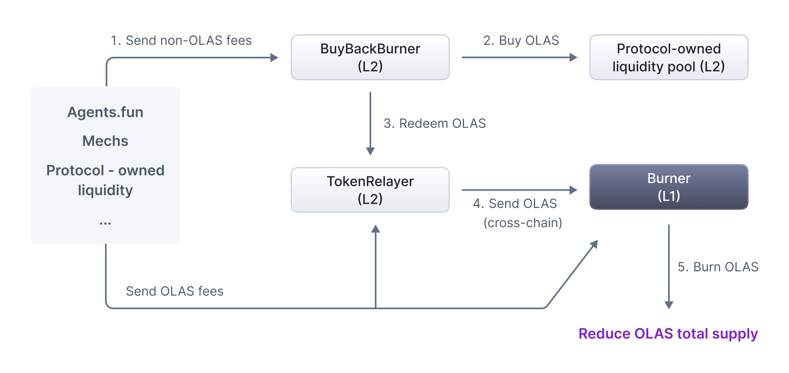

[AIP-5](https://github.com/valory-xyz/autonolas-aip/blob/aip-5/content/aips/automate_relayer_marketplace.md) discussed how fees can be earned from the mech marketplace. This proposal discusses how these fees may be used. We propose the introduction of a module available across all chains where the Olas Protocol is deployed. This module will accept both the chain's native token and OLAS and includes a mechanism for using native tokens to buy OLAS. The module furthermore supports the transfer of all accumulated OLAS to the Ethereum mainnet for burning.

## Introduction

This proposal introduces a universal buy-back-and-burn module designed to reduce the total supply of OLAS tokens. The module is deployable across all chains where Olas operates, and it allows for the seamless collection of fees in both native tokens and OLAS. Native tokens collected are utilized to purchase OLAS via decentralized exchanges (DEXs), ensuring price stability through time-weighted average price (TWAP) checks. Accumulated OLAS is subsequently transferred to Ethereum mainnet for burning, ensuring a consistent and transparent reduction in token supply. The mechanism is flexible and universal, accommodating current and future fee-generating use cases on Olas, such as dApp fees, protocol-owned liquidity, mech marketplace transactions, and developer rewards. By aligning economic incentives and fostering long-term sustainability, the module serves as a scalable solution for strengthening the Olas ecosystem.

## Take-away points

1. AIP-6 proposes a mechanism in order to use the fees generated within Olas ecosystem (including the ones introduced in AIP-5) in order to strengthen OLAS;
2. This is done via a buy-back-and-burn mechanism which receives all the fees in order to buy back OLAS and then burn it, reducing the total supply;
3. This module is partially implemented and live on Base and Celo. AIP-6 proposes to generalize it to all fees within the Olas ecosystem and to all chains. 

## Motivation

The buy-back-and-burn module provides a mechanism to reduce the total supply of OLAS by burning tokens accumulated from various use cases. Its universal design allows any new dApp or mechanism deployed on Olas to use it.

The Olas ecosystem has multiple existing and potential fee-generating use cases:

1. Fees from dApps built on the Olas Protocol, e.g. revenue from agents.fun, a launchpad for autonomous AI agent-affiliated meme coins, generated through liquidity providers (LPs); 
2. Fees from payments through the mech marketplace, where autonomous AI agents hire other agents (mechs) for specific tasks;
3. Fees from protocol-owned liquidity;
4. Fees from dev rewards in ETH, when the DAO decides to turn on the fee switch;
5. fees from protocol-owned services (as per [AIP-2](https://github.com/valory-xyz/autonolas-aip/blob/aip-2/content/aips/core-build-a-pose.md));

One can envision the possibility of further fee drivers:

1. Large-scale use cases like Olas Predict and Olas native mechanisms (e.g. dev rewards) could lead to the creation of Olas’ own L2 chain, generating sequencer fees;
2. Staking mechanisms could include a registration fee in OLAS, disincentivising Operators to not remain active or leaving slots unused.

This is not an exhaustive list but it should become clear at this point that a generic mechanism for facilitation of buy-back-and-burn is needed.

## Technical details

### Specification

The proposed module consists of three contracts: **BuyBackBurner**, **TokenRelayer** and **Burner**.

#### BuyBackBurner (L2)

The **BuyBackBurner** contract has the following main functions:

1. **buyBack**: called in order to buy a certain amount of OLAS from a DEX (function **_performSwap**), utilizing the protocol-owned liquidity pool; this function includes a comparison mechanism (function **checkPoolPrices**) between the current price of the DEX and the TWAP (time-weighted average price) obtained from historical data provided by an oracle (function **_getTwapFromOracle**); this prevents losses from potential price manipulation attacks (using flashloans).
2. **checkPoolPrices**: checks the condition that the current price on the DEX does not deviate too much from the TWAP.
3. **updateOraclePrice**: triggers the oracle to update its data
4. **sendToBurn**: sends OLAS to the TokenRelayer contract and calls its function bridgeToL1.

#### TokenRelayer (L2)

The **TokenRelayer** contract has one main function:

**bridgeToL1**: burns token representation on L2 and redeems L1 token equivalent on mainnet (it can be used by any entity on L2 as well to send OLAS for burning).

#### Burner (L1)

The **Burner** contract has one main function:

**burn**: burns OLAS tokens (it can be used by any entity on L1 as well to send OLAS for burning).

#### Workflow

The workflow is as follows:

1. various applications send native tokens to the **BuyBackBurner** contract;
2. with the native tokens received, OLAS is bought by **BuyBackBurner** on the protocol-owned liquidity pool;
3. All bridged versions of OLAS are burnt and original tokens are redeemed by **TokenRelayer**;
4. All OLAS is burnt by the **Burner** contract.

This is illustrated in the following figure. 

Notice that both **TokenRelayer** and **Burner** can also receive OLAS directly from anywhere.

### Rationale

Adoption of new agents and apps built and operated on Olas leads to a continuous growth of fees. Olas lacks a mechanism to recycle collected fees into its token economy. With this mechanism, fees are used to take OLAS out of circulation and reduce the total supply of OLAS.

### Security considerations

The system is decoupled from the rest of the Olas Protocol. It does not directly use any existing Olas Protocol mechanism and plugs nicely into existing protocol-owned liquidity pools and the OLAS burn method.

Care must be taken in implementing the buy-back logic to avoid MEV and flashloan exploits. The bridging mechanism also requires careful implementation and audits.

### Test cases

Currently, **BuyBackBurner** is deployed on Base (0xEea5F1e202dc43607273d54101fF8b58FB008A99, proxy: 0x3FD8C757dE190bcc82cF69Df3Cd9Ab15bCec1426) and Celo (0x71bF5C6D29b01E6A142c957d5A3DBB327CB774d1, proxy: 0x586D916819d9B707101f81e4cDD22cE119D1C220).

### Implementation

The code for **BuyBackBurner** can be found [here](https://github.com/dvilelaf/meme-ooorr/blob/main/contracts/BuyBackBurner.sol), and two children contracts [here](https://github.com/dvilelaf/meme-ooorr/blob/main/contracts/BuyBackBurnerBalancer.sol) (Balancer) and [here](https://github.com/dvilelaf/meme-ooorr/blob/main/contracts/BuyBackBurnerUniswap.sol) (Uniswap).

### Next steps

1. Code for **TokenRelayer**;
2. Audits;
3. Deploy & redeploy existing Base and Celo contracts, if needed.

## Copyright

Copyright and related rights waived via [CC0]((https://creativecommons.org/publicdomain/zero/1.0/).
