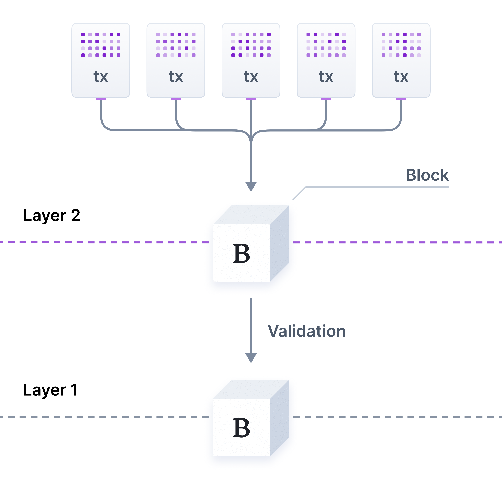
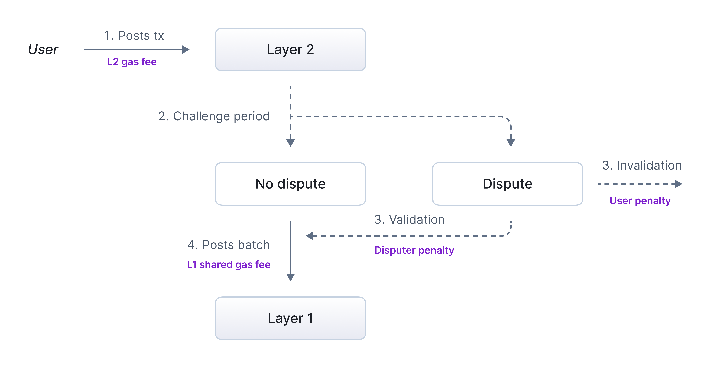

[I. Simple Summary](#i-simple-summary)

[II. Abstract](#ii-abstract)

[III. Motivation](#iii-motivation)

&nbsp; &nbsp; &nbsp; &nbsp;[III. 1. Section breakdown](#iii-1-section-breakdown)

&nbsp; &nbsp; &nbsp; &nbsp;[III. 2. Advantages of using Rollups](#iii-2-advantages-of-using-rollups)

&nbsp; &nbsp; &nbsp; &nbsp;[III. 3. Comparison between rollup stacks](#iii-3-comparison-between-rollup-stacks)

&nbsp; &nbsp; &nbsp; &nbsp;&nbsp; &nbsp; &nbsp; &nbsp;[III. 3. a. Optimistic rollups](#iii-3-a-optimistics-rollups)

&nbsp; &nbsp; &nbsp; &nbsp;&nbsp; &nbsp; &nbsp; &nbsp;&nbsp; &nbsp; &nbsp; 
&nbsp;[III. 3. a. i. Technical Comparison](#iii-3-a-i-technical-comparison)

&nbsp; &nbsp; &nbsp; &nbsp;&nbsp; &nbsp; &nbsp; &nbsp;&nbsp; &nbsp; &nbsp; 
&nbsp;[III. 3. a. ii. Brand and Network Effects](#iii-3-a-ii-brand-and-network-effects)

&nbsp; &nbsp; &nbsp; &nbsp;&nbsp; &nbsp; &nbsp; &nbsp;&nbsp; &nbsp; &nbsp; 
&nbsp;[III. 3. a. iii. Note on usage metrics](#iii-3-a-iii-note-on-usage-metrics)

&nbsp; &nbsp; &nbsp; &nbsp;&nbsp; &nbsp; &nbsp; &nbsp;&nbsp; &nbsp; &nbsp; &nbsp;[III. 3. a. iv. Developer community](#iii-3-a-iv-developer-community)

&nbsp; &nbsp; &nbsp; &nbsp;&nbsp; &nbsp; &nbsp; &nbsp;&nbsp; &nbsp; &nbsp; &nbsp;[III. 3. a. v. Conclusion](#iii-3-a-v-conclusion)

&nbsp; &nbsp; &nbsp; &nbsp;&nbsp; &nbsp; &nbsp; &nbsp;[III. 3. b. Zero-knowledge rollups](#iii-3-b-zero-knowledge-rollups)

&nbsp; &nbsp; &nbsp; &nbsp;[III. 4. Comparison of rollup-as-a-service solutions](#iii-4-comparison-of-rollup-as-a-service-solutions)

&nbsp; &nbsp; &nbsp; &nbsp;[III. 5. Incorporating the rollup in the protocol](#iii-5-incorporating-the-rollup-in-the-protocol)

&nbsp; &nbsp; &nbsp; &nbsp;&nbsp; &nbsp; &nbsp; &nbsp;[III. 5. a. From scratch](#iii-5-a-from-scratch)

&nbsp; &nbsp; &nbsp; &nbsp;&nbsp; &nbsp; &nbsp; &nbsp;[III. 5. b. Using a rollup framework](#iii-5-b-using-a-rollup-framework)

&nbsp; &nbsp; &nbsp; &nbsp;&nbsp; &nbsp; &nbsp; &nbsp;[III. 5. c. Using a rollup-as-a-service](#iii-5-c-using-a-rollup-as-a-service)

&nbsp; &nbsp; &nbsp; &nbsp;[III. 6. Sequencer revenues](#iii-6-sequencer-revenues)

&nbsp; &nbsp; &nbsp; &nbsp;&nbsp; &nbsp; &nbsp; &nbsp;[III. 6. a. Cost analysis](#iii-6-a-cost-analysis)

&nbsp; &nbsp; &nbsp; &nbsp;&nbsp; &nbsp; &nbsp; &nbsp;[III. 6. b. Transaction-specific costs diagram](#iii-6-b-transaction-specific-costs-diagram)

&nbsp; &nbsp; &nbsp; &nbsp;&nbsp; &nbsp; &nbsp; &nbsp;[III.6.c. Computing activity requirements](#)

&nbsp; &nbsp; &nbsp; &nbsp;[III. 7. Choice of gas token](#iii-7-choice-of-gas-token)

&nbsp; &nbsp; &nbsp; &nbsp;&nbsp; &nbsp; &nbsp; &nbsp;[III. 7. a. Factors to consider](#iii-7-a-factors-to-consider)

&nbsp; &nbsp; &nbsp; &nbsp;&nbsp; &nbsp; &nbsp; &nbsp;[III. 7. b. Modelisation](#iii-7-b-modelisation)

[IV. Specification](#iv-specification)

[V. Rationale](#v-rationale)

[VI. Security considerations](#vi-security-considerations)

[VII. Test cases](#vii-test-cases)

[VIII. Implementation](#viii-implementation)

[IX. Next steps](#ix-next-steps)

[X. Copyright](#x-copyright)

# I. Simple Summary

The purpose of this proposal is to introduce the use of a ***rollup*** - which shall be called Olas Rollup - in order to scale Olas ecosystem and generate additional revenues by capturing fees from the use of the rollup. 

# II. Abstract

In [III. Motivation](#iii-motivation), we discuss advantages of using a rollup, and provide a detailed discussion of the diverse ways to incorporate a rollup in the Olas ecosystem. We compare rollup stacks (optimistic rollups and zk-rollups), then rollup-as-a-service solutions, and the advantages of developing a rollup from scratch, using a rollup framework or a rollup-as-a-service. We also discuss possible revenues for the protocol via the rollup and the conditions under which actual revenues would be generated (taking into account the costs of building and running it). We end this section with a discussion on the diverse possibilities for gas token definition (ETH, stablecoin, OLAS).  

# III. Motivation

**Rollups** are Layer 2 solutions designed to improve scalability by processing transactions in bundles, off-chain. Validation of these bundles of transactions is done when settling on Layer 1. This general principle is illustrated in the following figure. 

This helps reduce gas fees and increase throughput. 

This section discusses the benefits and details of the introduction of a rollup in the Olas ecosystem. 

## III. 1. Section Breakdown

It is organized into the following subsections:

- **[III.2. Advantages of using Rollups](#iii-2-advantages-of-using-rollups)**: lists the advantages of using rollups, in particular generating revenues for the protocol.   
- **[III.3. Comparison between rollup stacks](#iii-3-comparison-between-rollup-stacks)**: compares the two main optimistic rollups technologies, namely Optimism and Arbitrum, and zk-rollups.  
- **[III.4. Comparison of rollup-as-a-service solutions](#iii-4-comparison-of-rollup-as-a-service-solutions)**: compares roll-up-as-a-service solutions which are based on optimistic rollups. 
- **[III.5. Incorporating the rollup in the protocol](#iii-5-incorporating-the-rollup-in-the-protocol)**:  this section compares approaches for constructing a rollup and incorporating it; from scratch, using a rollup framework, or using a rollup-as-a-service.
- **[III.6. Sequencer revenues](#iii-6-sequencer-revenues)**:  in this subsection, we discuss how fees may be collected from the use of a sequencer provided by a rollup-as-a-service and conditions under which charging a fee for this service would be beneficial for the protocol.  
- **[III.7. Choice of gas token](#iii-7-choice-of-gas-token)**: here we discuss the respective benefits of using OLAS versus a stablecoin in order to pay gas.   

### III. 2. Advantages of using Rollups

The main advantages for introducing a rollup are the following ones for Olas ecosystem:

1. Revenues for the protocol, taking on the profit margin of sequencer fees (where the sequencer is the key component responsible for ordering and processing transactions off-chain before they are batched and submitted to the underlying L1 blockchain); 
2. Native Olas mechanisms (like developers rewards for instance) would be more cost-efficient since: there would be more frequent and cost-efficient rewards (in particular by ordering the flow of transactions in such a way that throughput and/or gas cost is optimal), as gas costs are lower with rollup and because of the possibility to create fully OLAS native dev rewards; there would be no need for ETH donations, providing better user experience and saving resources; 
3. Capture gas from usage of Olas Predict (as opposed to fees paid to Gnosis miners and validators on L1) and similar future use cases;
4. Increased scalability (handling more transactions per second);
5. Strengthening of OLAS utility token status if OLAS is used as a gas token.

In the following, we shall distinguish between **rollups** and **optimiums**. While the second ones are sometimes also referred to as rollups, they differ strictly speaking from rollups in terms of security. Consider the definitions which can be found [here](https://l2beat.com/glossary#one-time-pad). While rollups *“inherit consensus and data availability”* from the L1 chain, optimiums are *“off-chain solutions that use fraud proofs for settlement and publish the data off-chain”*. In particular, rollups favor security over finality speed. In the following, we will keep the term *”rollup”* and specify which solutions should be considered as optimiums. 

### III. 3. Comparison between Rollup Stacks

#### III. 3. a. Optimistic Rollups

Arbitrum and Optimism are the two main rollups solutions. Most new dApps choose one of them for their fast development compared to other solutions. Here are some sources of information respectively for Arbitrum and Optimism rollups: 

[Arbitrum rollups](https://medium.com/offchainlabs/how-arbitrum-rollup-works-39788e1ed73f)
[Optimism rollups](https://docs.optimism.io/stack/protocol/rollup/overview)

##### III. 3. a. i. Technical Comparison

1. Initially, the main technical difference between the two was that Optimism used *single-round fraud proofs* while Arbitrum used *multi-round fraud proofs*. The latter is a more advanced technology which is meant to minimize on-chain computation and optimize off-chain computations, making it more scalable (reduced gas cost). Whenever a dispute arises, updates are smaller and faster. Furthermore, when the network is idle (meaning that no transaction is currently executed), no (empty) batch of transactions is executed, optimizing resource (in particular gas) usage. **However this difference no longer exists, as both Optimism and Arbitrum use multi-round proofs**.

2. Feature comparison: 
    - **Native gas token support**: both Arbitrum and Optimism use by default ETH for gas fees, but offer the possibility to use ERC-20 tokens (for instance xDAI) for gas (see doc [here](https://research.arbitrum.io/t/security-and-governance-considerations-for-chain-clusters/9560) and [here](https://medium.com/offchainlabs/your-chain-your-rules-offchain-labs-technical-roadmap-to-fuel-arbitrum-innovation-f787f2e85966)). Note that many orbit chains implementing custom gas tokens are live, but OP chains with custom gas tokens cannot participate in the first batch of the interoperability set (although they can participate in the superchain) - by first batch we meaning the initial group of chains, which are fully interoperable [Base, Zora, etc];
    - **Throughput**: This varies with the chain. The higher throughput chains range from around 10 TPS to around 130 TPS. The highest is 130 TPS for Base on the Optimism side, and 60 TPS for Xai on the Arbitrum side (see data [here](https://rollup.wtf/)).  
    - **Path to decentralization**: 
        - Arbitrum: decentralizing the sequencer, introducing community governance through the DAO (already existing and robust on-chain governance system, see here), decentralizing validators and fraud-proof mechanisms, and enabling permissionless participation;
        - Optimism: decentralizing its governance (via the Optimism Collective), the sequencer, security through fraud proofs, and validators. Optimism aims to decentralize the network by enabling a broader range of chains to join the ecosystem via the superchain.

        Both Arbitrum and Optimism are stage 1 rollups (stages are labels for how much a rollup is decentralized).
    - **Block times**: The standard block time on Arbitrum chains is 0.25s when using the “Time boost” mechanism (which enables priority wallets to have lower block time), with the option to bring them as low as 0.1s. Otherwise, the block time is 0.45s. The standard block time is 1s for Optimism, with the option to bring it to 0.25s with “Rollup Boost”.
    - **Behavior when network is idle**: while Arbitrum does not create any block when the network is idle (waiting for transactions), Optimism continuously produces blocks even if these blocks are empty (system transactions, which include ensuring cross-chain communication between L1 and L2, maintenance tasks, fee adjustments for instance). This creates continuous overhead costs for the chain, even if there are no transactions in a block. However, this does not incur any cost. 
    - **Governance structures**: Optimism has a decentralized governance framework (Optimism collective) in which can opt-in or not. When choosing to do so, the chain benefits from common architecture and higher interoperability. This implies on the other hand some rigidity of the sequencer/node design, core protocol and contracts, and that the chain must be governed by the OP token. Chains based on Arbitrum or OP Stack chains not governed by Optimism collective have more governance freedom: this means complete autonomy over the sequencer/node design, the core protocol and contracts.  Any OP Stack and Orbit chain can settle to any parent chain or L2 (including OP, Base, or Ethereum). For Orbit chains, iif an orbit elects to settle to Arbitrum One or Arbitrum Nova, they do not have to share sequencer revenues with the DAO. Finally, OP Stack chains not governed by Optimism collective and Orbit chains are free to be governed by any token and contract structure. 
    - **Revenues share**: If an Arbitrum Orbit chain decides to settle on a chain other than Arbitrum One or Nova, they are mandated to share 10% of sequencer profits with the DAO. The OP Stack chains who join the superchain choose between sending 2.5% of their sequencer revenues to the collective or 15% of net profit (revenues - costs).
    - **Speed of withdrawal/finality**: Orbit chains can use a DAC (data availability committee); such a committee provides data storage off-chain, making data, used to verify withdrawals, retrievable faster, compared to data stored on-chain. This leads to faster withdrawal (as low as 15s) and transaction finality on the parent chain, and also faster cross-chain state synchronization (see here). Note that using a DAC lowers security in comparison with using ETH DA makes any such chain an optimium (see definition above).  
    - **Development costs**: Abitrum Stylus allows developers to write EVM (Ethereum virtual machine) equivalent smart contracts in programming languages that compile to Wasm (WebAssembly) - for instance, Rust, C, C++. This makes memory and computations cheaper than a traditional EVM. Note that this is interesting for Olas, as this lowers the entry barriers for developers (see here). Note also that Stylus offers access to several AI libraries in C, C++ and Rust (for instance TensorFlow, OpenCV, FANN, Darknet in C, TensorFlow, Pytorch, Caffe, MLpack, Dlib, OpenCV, Shark, Armadillo in C++ and tch-rs, rust-bert,linfa,smartcore,ndarray, burn in Rust) which is also interesting for Olas. Arbitrum Foundation has also initiated a Grant Program for Arbitrum Stylus, for the development of high quality smart contracts and tooling (funded up to $2.5 millions).   

##### III. 3. a. ii. Brand and Network Effects:

Let us compare Optimism and Arbitrum in terms of adoption. We consider three factors here: brand, engagement with developers and projects, and network effects. 

First, Optimism has a **stronger brand** in the Ethereum L2 space. 

In terms of developer support, Base has a robust set of tools aiming at attracting developers and projects, including developer friendly APIs, seamless access to Coinbase infrastructure (which provides for instance liquidity solutions). These tools are shared with other chains in the superchain (this would be particularly interesting for Olas ecosystem which focuses on DeFi applications at the moment). On the other hand, Arbitrum/Offchain team frequently gets feedback from developers that the support is more helpful than the one of Optimism in terms of responsiveness, speed, and hands-on support from integration engineers. Arbitrum also provides access to their business development and strategy team to help chains with their go-to-market needs (market analysis, technical support, etc).   

Both aim at creating a network of interconnected blockchains that communicate and share resources effectively (interoperable L2 ecosystem). This is in place for Optimism. Arbitrum and Orbit have a clear plan for interoperability. The mechanism is similar to Optimism. 

The specificities of the two approaches are the following ones: 

1. **Optimism**: interoperability is achieved through the ***Superchain*** model, in which multiple Optimistic rollups can interoperate seamlessly. However only those can interoperate. This creates a cohesive ecosystem but limits interoperability with external blockchains. The Superchain model ensures high security and efficiency for the chains involved, as they share resources and governance. This can be restrictive for developers who wish to connect with chains outside this ecosystem, however such chains can opt for application-level interoperability, using for instance LayerZero (which is a cross-chain messaging protocol which facilitates interoperability by allowing data and assets to move seamlessly between chains). This model also limits customizability and sovereignty of the chains – making customizations less feasible and necessitating shared security assumptions across all Superchain chains (when they are connected). This means that a security vulnerability on one chain can potentially impact all the other chains that are part of the Superchain. This vulnerability with regard to interoperability design is the reason that OP governance has control over the sequencer/node design, the core protocol and contracts, and that the chain must be governed by the OP token. 
2. **Arbitrum**: In contrast, Arbitrum has introduced a ***chain mesh*** approach, allowing any chain to choose its interoperability partners freely (see here and here). This grants developers and users greater flexibility to connect with a wider range of blockchains. Each chain can engage with others based on mutual agreements, which could lead to a more diverse ecosystem. This flexibility may encourage innovation and collaboration across various chains, as developers are not confined to a specific set of interoperable chains and can establish connections with any chain they deem beneficial. This also allows for unlimited customization and governance sovereignty for the chain. Note that Olas targets in principle a wide range of services, which makes this approach more interesting. Arbitrum also has a long-term plan for opt-in interoperability in clusters, a short term plan for intent-based interoperability (users can move funds/swap in 1-3 seconds). 

Specifications for OP Stack interoperability can be found [here](https://specs.optimism.io/interop/overview.html).

Let us list here adopters of each technology (the list is probably not exhaustive). We should distinguish projects using their rollups and rollups built upon each stack.  

- Projects using the rollups: 
    1. Optimism: Uniswap, AAVE, Aerodrome, Velodrome, Morpho, Chainlink, Alchemy, Synthethix 
    2. Arbitrum: GMX, The Graph (see article here), Uniswap v3, Alchemy, Chainlink
- Rollups built upon the stacks: 
    1. OP Stack: [Kraken](https://www.kraken.com/), [Lisk](https://lisk.com/), [Mode](https://l2beat.com/scaling/projects/mode), [Zora](https://support.zora.co/en/articles/1367745#:~:text=Zora%20Network%20is%20built%20on,Zora%20does%20not%20operate%20it.), [Base](https://base.mirror.xyz/H_KPwV31M7OJT-THUnU7wYjOF16Sy7aWvaEr5cgHi8I) (by Coinbase), [World Chain](https://blockworks.co/news/worldcoin-teases-world-chain-layer-2) (by Worldcoin), [Unichain](https://cryptoslate.com/uniswap-introduces-unichain-sparking-a-12-surge-in-uni-token/) (by Uniswap), [Redstone](https://redstone.xyz/), [opBNB](https://docs.bnbchain.org/bnb-opbnb/core-concepts/why-opstack/), [DeBank](https://decrypt.co/152202/ethereum-defi-dashboard-debank-launches-layer-2-on-optimisms-op-stack)
    2. Arbitrum Orbit: Ecosystem of 36 orbit chains on mainnet, and 30+ on testnet. This includes [Proof of Play](https://www.proofofplay.com/)’s Apex Chain and Boss Chain [to support its crypto game Pirate Nation, with throughput of 18mgas/s], [Ape Chain](https://apechain.com/) [gaming,entertainment], [Xai](https://xai.games/) [gaming chain,L3], [Anime Chain](https://x.com/Azuki/status/1772973156254253079) (Azuki) [entertainment], [Gravity](https://gravity.xyz/), [Degen](https://www.degen.tips/) [decentralized social media], Sanko, [Superposition](https://superposition.so/) [DeFi]. [Reya](https://www.reya.network/), [re.al](http://re.al). Note that strictly speaking, several of these should be considered as optimiums rather than rollups.

Note that 70+ chains have publicly announced using the Orbit stack.

In terms of networks and branding effect, note that there is synergy between Arbitrum Stylus (in particular its AI libraries) and Olas, which may create a co-marketing effect.  

##### III. 3. a. iii. Note on usage metrics:

There are two possible ways to measure the respective daily activity and total locked value. One can restrict to the respective mainnet of the rollups (this concerns the activity of projects which use them), or add the activity and total locked value of rollups based on their respective stacks. 

The first option does not account for the total ***“technological weight”*** (as a significant amount of it lies in rollups built on the stacks, as visible in the lists provided in [section III. 3. a. ii.](#iii-3-a-ii-brand-and-network-effects)). This is why the second option is most commonly used.

**Arbitrum One versus OP mainnet**:
For information, as of April 2024, Arbitrum recorded 300k daily active users while Optimism recorded 130k daily active users. In terms of transactions count, Arbitrum is currently more active than Optimism in terms of daily transactions, TVL and DEX trading volumes (see for instance this Dune [dashboard](https://app.artemisanalytics.com/chains)). In terms of total locked value, this dashboard displays for instance $2.4bn for Arbitrum and $662.2 millions for Optimism at the end of October 2024. 

**Comparison between Orbit chains and OP-stack chains**:
For the second option, we would need to have an exhaustive list of rollups based on each stack, which is difficult to track. For instance, Base (which relies on OP Stack) recorded 350k daily active users in April 2024. Base is also dominant in terms of TVL and DEX volumes (see [here](https://defillama.com/chains/Rollup) and [here](https://defillama.com/dexs/chains) respectively). This tends to indicate, based on the rollups found, that the total technological weight of Optimism is currently higher than the one of Arbitrum (note: one can find more stats on the orbit ecosystem [here](https://portal.arbitrum.io/orbit/ecosystem)). 

One can find [here](https://rollup.wtf/) real time TPS/throughput ranking data for diverse rollups, collected by Conduit. 
This includes 15 Orbit chains and 27 OP-Stack chains, and six others (Polygon zk-EVM, Linea and Metis,Scroll, Taiko, zkSync Era). In terms of transactions per second (TPS), Base is clearly dominant. In terms of computational capacity (Mgas/s), Base and ProofOfPlay chains. In terms of data throughput (KB/s), Base followed by six Orbit chains. Note that for Olas, the two last measures are more important.

##### III. 3. a. iv. Developer community:

Let us compare Arbitrum and Optimism in terms of developer community. We compare them in terms of participation of developers to governance and tools made available to developers.  

1. **Optimism** has a strong emphasis on EVM-equivalence (this refers to the compatibility with the Ethereum Virtual Machine (EVM) at a very high level of fidelity, meaning that the chain operates in a way that is nearly identical to Ethereum’s EVM in terms of functionality, allowing developers to deploy Ethereum-based smart contracts and dApps on it with minimal or no modification). More centralized than Arbitrum but progressively moving towards more decentralization. 
2. **Arbitrum**: has a larger Discord community. Its developer community is more focused on DeFi (this would be particularly interesting for Olas ecosystem which focuses on DeFi applications at the moment), performance scalability [because of its focus on minimizing fees and maximizing transaction throughput]. Arbitrum also has EVM-equivalence, and is governed by a DAO (which means in particular that developers can participate in governance). 

##### III. 3. a. v. Conclusion:

*Arbitrum* is more suitable for projects: prioritizing security and cost-effective dispute handling; benefiting from performance advantages; not wanting to submit to external governance and looking to make customizations without sacrifice; valuing faster finality and block times; seeking larger user base and higher liquidity. 

*Optimism* is more suitable for projects: valuing simplicity;; prioritizing reputation and community focus (as effect of Optimism branding).

#### III. 3. b. Zero-knowledge rollups 

In opposition to optimistic rollups, **zero-knowledge rollups** (or zk-rollups), instead of assuming by default that transactions are valid, use zero-knowledge proofs in order to validate transactions.

**Comparison with optimistic rollups**: 
While optimistic rollups are well-suited for applications where immediate finality isn't critical and where the focus is on cost efficiency, zk-rollups are ideal for applications requiring high privacy and security, such as financial transactions or applications that handle sensitive data.

**Main zk-rollup solutions**:
The main zk-rollups solutions are the following ones: 

1. **zkSync**: Focus: scalability and efficiency, security and developer experience;
2. **StarkNet**: Focus: simplification of the development process, reduced transaction costs;
3. **Polygon zkEVM**: Focus: enhancing throughput on Ethereum without compromising decentralization or ​​security;
4. **Scroll**: security, transparency, and creation of a reliable infrastructure which aligns closely with Ethereum’s principles and user experience.

As Olas ecosystem aims at a broad range of applications, it might be best to consider a combination of zk-rollups and optimistic rollups, such as Polygon Nightfall. Note that Arbitrum is also working on hybrid proving, in the sense in the Arbitrum rollup and dispute resolution protocol, ZK proofs will eventually be used, in future upgrades, to instantly confirm assertions, acting as an optional and fast path to confirmation on the parent chain. Optimistic proving could still be used if ZK proofs are not provided; this enables users and developers on Arbitrum chains to access very fast native interoperability on an as-needed basis (see here).

However zk-rollups are not production ready and no rollup-as-a-service recommends them at the moment. Hence the choice is oriented towards optimistic rollups. 

### III. 4. Comparison of Rollup-as-a-Service Solutions

A **Rollup as a Service** (RaaS) is a cloud-based solution that provides developers with the infrastructure and tools to deploy and manage rollup solutions on blockchains without needing extensive expertise in blockchain technology. RaaS enables projects to leverage the scalability and efficiency of rollups while simplifying the development process through easy-to-use interfaces, pre-configured settings, and ongoing support.

Let us provide a comparison of the main rollup-as-a-service solutions (on L1 ethereum). 
The main solutions are AltLayer, Conduit, Caldera, Ankr and Zeeve, Alchemy rollups, Gelato, QuickNode, Ankr, Snapchain, Saga, Alembic, Vistara, Bison labs. 

Let us compare the ones which rely on optimistic rollups:  

1. **AltLayer**: focus on customization, support for various rollup types, performance optimization, and developer-friendly tools;
2. **Ankr**:  leading web3 infrastructure provider powering leading chain-native infra like Optimism's default RPC endpoint [https://mainnet.optimism.io], delivering the same robust infrastructure support for each chain launch; full CDN network deployment with a focus on high-throughput scaling; benchmarked as the fastest global RPC provider, battle-tested with over 8B+ RPC calls served daily across 60+ networks; infrastructure provider since 2016, offering a complete stack and feature customization, and full-service support;
3. **Caldera**: high throughput, low latency, and customizable features for optimizing the performance and user experience;
4. **Conduit**: emphasis on developer ease of use, automation capabilities, and focus on gas efficiency; Key facts: first rollup-as-a-service in terms of market share (according to public data (I2beat) over 55% of market share, and at least 70% based on private data) and performance/features (most performant and scalable rollups, in particular with the G2 sequencer which is 10x more performant than other existing ones, with 100Mgas/s of throughput, see [here](https://cryptonewsland.com/conduit-g2s-100-mgas-s-sets-new-standard-for-onchain-games-and-dexs/)); history of pioneering in incorporating new technological advancements (OP succinct for instance, developed by Optimism and leverages “succinct proofs”, enabling faster transaction verification and reduced costs for users); 
5. **Gelato**: enterprise-grade infrastructure including unique microservices that help with connecting to chains and making agent-to-agent communication fast, seamless, gasless and reliable while being uniquely positioned to help decentralize the stack over time through working with some of the best teams in the space including Kraken or Fox News. Gelato’s RaaS solution uniquely offers native account abstraction, including the leading transaction relay service. This service provides efficient, reliable, and scalable transaction relaying across 30+ blockchains, with reduced latency compared to other RaaS providers, enhancing the overall performance and responsiveness of the rollup.
6. **Zeeve**: Key RaaS provider supporting both Optimistic and ZK Rollup stacks, fully managed Enterprise-grade infrastructure, in-depth expertise with protocol stack-level customizations, and focus on scalability and security. Native integration with Traceye Data Indexing, Tracehawk Block Explorer, Cero decentralized sequencer, RaaS dashboard, Account Abstraction, Decentralized Provers, DAs, etc. Also brings strong KOLs and co-marketing support.

### III. 5. Incorporating the Rollup in the Protocol

In this section, we compare the possibilities for incorporating the rollup, and argue for the use of rollup-as-a-service. 

#### III. 5. a. From scratch

In this case, the aim would be to develop entirely a fully customized rollup (which does not imply becoming a rollup-as-a-service).

**Advantages and drawbacks**: The main advantage is simply having full control over the architecture. However the construction is a complex process requiring a high level of expertise, it is costly in terms of time.  

**Steps**: 

Choices to be made for parameters. Provided that an optimistic rollup is built:  
1. How often to settle on Ethereum ? 
2. How much data is posted then (batch size) ? 
3. What is the duration of the challenge period ? 
4. What would be incentives for challengers ? 

After these choices, the steps are the following (if choosing to develop the rollup): 

1. Implement smart contracts on Ethereum;
2. Integrate the rollup with the existing project
3. Setting up the sequencer and operator infrastructure
4. Testing the rollup implementation 
5. Security audits
6. Mainnet launch

All these steps require labor and time (12-24 months approximately until launch).

#### III. 5. b. Using a rollup framework

Using a *rollup framework* can simplify the construction of the rollup, but still requires expertise. The steps are similar as the ones for constructing it from scratch, but a framework offers pre-built components (for instance for fraud/validity proofs) and is continuously updated. Examples of frameworks: Optimism’s OP Stack, Stackr, Dymension, Arbitrum Orbit.

In this direction, the main factor to consider is whether the pre-built components are sufficient for the target customization or not. 

#### III. 5. c. Using a rollup-as-a-service

For incorporating the rollup-as-a-service, the steps are the following ones, after making choices of characteristics of the rollup and choosing a solution: 

1. Setup and configuration: creating an account, API keys, configure parameters (gas pricing and fee structure, L1-L2 bridging, etc) 
2. Integration to the project: deploy contracts which allow users to deposit funds into the rollup and withdraw back to L1 and for handling L2 transactions (for instance contract interactions, token transfers); update on-chain logic to route transactions to the rollup instead of L1. 

The respective time to launch for development and using a rollup-as-a-service are 12-24 months and around 2-4 months. The first one comes with a labor cost while the second one comes with a subscription fee. 

**Path to decentralization**: Note that using a rollup as a service leads in principle to more centralization and single point of failure via the sequencer (this is the case for the ones which rely on Optimism and Arbitrum) than the other two options, which allow decentralization of the sequencer (via competition to be the sequencer). Example of Layer 2 network which relies on a decentralized sequencer: [Metis](https://www.metis.io/decentralized-sequencer). 

**Advantages**:
Leveraging a Rollup-as-a-Service (RaaS) provider equips rollups with a comprehensive suite of essential infrastructure components. This setup includes key services such as:

- **Bridges** (e.g., LayerZero, Across, Socket, LiFi)
- **Oracles** (e.g., Pyth, Redstone, DIA)
- **Account Abstraction** (e.g., Gelato, Biconomy, Thirdweb) - idea of making blockchain accounts more flexible by enabling them to handle transactions and functionalities in a more customizable way.
- **Indexers** (e.g., Goldsky, The Graph) - ​​An indexer is a service or tool that organizes, processes, and stores blockchain data in a way that makes it easy to query and retrieve.

In particular, account abstraction is highly advantageous for AI agents, as it enables gasless transactions on the OLAS rollup (gas abstraction). This allows for frictionless agent-to-agent communication on the chain through transaction relays and bundlers. 
  

### III. 6. Sequencer Revenues

In the same way as in [AIP-5](https://github.com/valory-xyz/autonolas-aip/blob/aip-5/content/aips/automate_relayer_marketplace.md), we consider potential revenues that charging users fees for the use of Olas Rollup could bring to the protocol. 

#### III. 6. a. Cost analysis

Let us consider costs incurred by using a rollup-as-a-service in general. 

1. Fixed subscription (for running the sequencer and maintaining the infrastructure); 
2. Usage-based subscription (depending on usage of the rollup);
3. Share of sequencer revenues;
4. Settling on Ethereum (posting transaction data on L1 after the challenge period has ended, for optimistic rollups). Note that this varies on the stack: Orbit chains settle less frequently on Ethereum, and do not produce blocks when the network is idle (see [here](https://subscriptions.theinformation.com/newsletters/slow-burn/archive/a-dapp-developers-guide-to-appchains)). 
5. Dispute verification (during the challenge period). 

The two first costs are not transaction-specific and are thus paid by the protocol (note that this is a centralization issue). The third cost corresponds to gas fees that are paid by users. Gas is paid by transaction posted on L2. Then users pay gas for posting on L1, as a fixed share of the cost for posting a transaction batch on L1. The fourth type of costs should in principle be paid by users and it is possible to craft a custom rollup with RaaS so that: the disputer pays dispute verification costs when they are not right; otherwise when the disputer is right, the gas fees for the transaction batch and the dispute verification cost are paid by the defaulting user. 

In general the fixed subscription together with usage-based subscription amount to $10k a month (note that this is a market standard).

Let us list here the subscription models: 

1. **Altlayer**: fixed subscription model with tiered-based pricing based on usage;
2. **Ankr**: multiple packages. Starter package (<10k transactions a day) at $2750/month; Advanced package (<100k transactions a day) at $5800/month; Enterprise package: custom solution and pricing;  
3. **Conduit**: fixed subscription of $3k a month and takes 5% of sequencer revenues;
4. **Gelato**: fixed subscription for the first two years; subscription can be paid in OLAS; takes 1% of sequencer revenues.
5. **Zeeve**: Fixed subscription model with tiered-based pricing based on usage, plus 1-3% of net sequencer revenue share; payment options of Fiat, Stablecoins, and native tokens

#### III. 6. b. Transaction-specific costs diagram

The following picture illustrates transaction-specific costs: 

#### III. 6. c. Computing activity requirements 

Suppose revenues for the protocol correspond to 10% of gas fees (rate similar to gas abstraction, see AIP-5), and that a share **r** of the revenues are taken by the RaaS. The gas paid for one transaction would be: 

**(average_usd_per_tx_L1/number_of_transaction_per_batch)+ average_usd_per_tx_L2**

The total revenue per month would be: 

**(1-r)*number_of_transactions_per_month* [(average_usd_per_tx_L1/number_of_transaction_per_batch) + average_usd_per_tx_L2]/10 - subscription_fee**, 

Assume a number of transactions per batch equal to 2000. With an average gas fee of $0.05 on L2 and $4.623 on L1 (ETH, see here) we get the following: 

**total_revenue = (1-r)*n *[(4.623/2000)+0.05]/10 - s = (1-r) * 0.00523115 * n - s**,

where **n** is the number of transactions per month and **s** is the subscription fee. Thus:

**n = (total_revenue + s)/((1-r) * 0.00523115)**

Here is a table of example numbers: 

| | Low usage (2000$/month deficit) | Medium usage (zero revenue) | High usage (15000$/month revenue) |
|----------|----------|----------|----------|
| Base subscription fee (3k) + 5% of revenues taken   | 201,223  | 603,671   | 3,622,027 |
| Standard usage (10k) + 5% of revenues taken   | 1,609,689 | 2,012,237 | 5,030,593 |

| Base subscription fee (3k tx) + 1% of revenues taken   | 193,093 | 579,280 | 3,475,682 |

| Standard usage (10k) + 1% of revenues taken   | 1,544,747 | 1,930,934 | 4,827,337 |

### III. 7. Choice of Gas Token

The rollup would need to define a token in order to pay gas for settlement on L1 (Ethereum). There are multiple choices here, including: native token (OLAS), ETH, or a stablecoin (like xDAI). 

#### III. 7. a. Factors to consider

Typically, the rollup would require a gas payment in the chosen token, which is eventually converted into ETH in order to pay gas for settlement on Ethereum. Note that for the Orbit chains with AnyTrust (suite of APIs designed to facilitate bridging operations, see [here](https://docs.arbitrum.io/launch-orbit-chain/concepts/custom-gas-token-sdk)), payment in the native token for DA fees (data availability) is enabled. Furthermore, AnyTrust lowers significantly transaction costs which implies that more revenues can be generated by the protocol. The DAC handles verification and settlement on Ethereum is less frequent, which reduces the conversion fees. This is not the case for Optimism, which settles frequently on Ethereum (increasing costs).

Provided this, let us expose the diverse arguments in favor of each of these choices. Here are the factors that should be considered: 

1. **Volatility**: if the value of the gas token is very volatile (this can be the case of ETH and OLAS), the users may pay higher fees than when the value is stable (typically if it is a stablecoin); fees could be lower as well, but there is a risk; furthermore, the absence of volatility makes costs more predictable and simplifies cost forecasting for running dApps; this is thus important for the growth of activity within the Olas ecosystem.
2. **Liquidity**: the gas token must be liquid, as continuous activity of the rollup implies continuous gas payments; although there are liquidity pools for OLAS (coming from bonding), liquidity is higher for ETH or stablecoins;  
3. **Utility**: in principle, if the gas token is OLAS, this should strengthen the token’s role in the ecosystem’s economy (increased utility); this implies more holders for the token and more activity within the ecosystem; furthermore, using another token would make the ecosystem functioning dependent on the value of another token, in which case it may be sensible to volatility (especially in the case of ETH); 
4. **Conversion costs**: in principle as well, if the gas token is OLAS, this favors OLAS holders, as there are no fees for converting another coin into OLAS before making gas payment. However, this implies that the rollup itself makes the conversion from OLAS to ETH, and the fees paid are then reflected in the OLAS gas price (this is also the case for the stablecoins);
5. **Token value**: using OLAS as a gas token would imply a high sell pressure (rollup constantly selling OLAS for ETH), meaning that the token value would decrease; this would be negative for OLAS holders. This is especially true in the early phase of the ecosystem’s development, while in later phases this selling pressure would be counterbalanced. 

#### III. 7. b. Modelisation

Let us provide a model for payment of gas fees on the rollup and counter the sell pressure effect described in [section III.7.a)](#iii-7-a-factors-to-consider) above and benefit from low volatility of stablecoins or utility increase if using OLAS as gas token. Typically, the rollup takes payment in the chosen token and then converts it into ETH in order to pay gas fee for L1 settlement, and the user pays the conversion fee. 

We assume, as it is typically the case, that the conversion from the gas token to ETH is handled by a third-party liquidity pool which follows constant product formula (as it is the case in Uniswap for instance): 
**x y = k**,
where **x** and **y** represent respectively the reserves of the two tokens in the liquidity pool, and **k** is a constant fixed at the deployment of the LP. 

In that case, users would send the gas token (here OLAS or stablecoin, xDAI for instance) to the rollup which would swap it using the LP for ETH and then pay gas. This would mean that only the gas token is added to the pool, which implies a lower and lower quantity of ETH in the pool and higher and higher quantity of the gas token must be added in order to keep the balance determined by the formula xy = k. 
We thus need a mechanism to systematically rebalance the pool (which solves the liquidity issue as well as the token value issue). 

*This could be done by incentivizing the “liquidity balancers” in a way that covers swapping fees, and these incentives can be taken directly from the revenues generated by the sequencer.*

*For this to be possible, swapping fees must be comparable to gas fees for the transactions so that the total user-faced fee is lower with the rollup than without. Equivalently, liquidity providers and “liquidity balancers” are rewarded with a portion of the revenues generated by the rollup.*

# IV. Specification  
# V. Rationale  
# VI. Security Considerations  
# VII. Test Cases  
# VIII. Implementation  

# IX. Next Steps

Completed steps:  
- Take feedback from Arbitrum and Optimism ecosystems.  
- Take feedback from RaaS providers.  

Remaining steps:  
- Snapshot vote to select rollup stack.  
- Snapshot vote to select RaaS provider.  

# X. Copyright  

Copyright and related rights waived via [CC0](https://creativecommons.org/publicdomain/zero/1.0/).